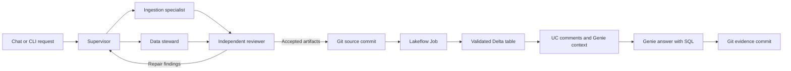

# Weather API to Genie

A Databricks supervisor coordinates three specialists to turn a public weather API snapshot into a reviewed Delta dataset and a configured Genie Agent.

The demo uses Copenhagen, Aarhus, and Odense for September 21-27, 2026. The source is Open-Meteo's ERA5 reanalysis. The fixed snapshot contains 21 daily rows. This is a bounded lab, not a general API ingestion service.

## What happens



- The ingestion specialist proposes the field mappings and ingestion specification.
- The data steward writes column meanings, units, source evidence, and aggregation rules.
- The reviewer checks both outputs. Deterministic checks can reject a model's approval.
- The supervisor chooses the next permitted specialist. Failed review permits at most two repair cycles.
- Ordinary tools render the checked-in pipeline template, publish artifacts, run ingestion, and configure Genie.

Genie receives the table, column descriptions, instructions, measures, and example SQL. Genie does not inherit the other agents' conversations. Git stores the reproducible handoff. Local receipts or a UC volume store private resource IDs and phase results.

## Install tools

Install [Git](https://git-scm.com/downloads), [uv](https://docs.astral.sh/uv/getting-started/installation/), [GitHub CLI](https://cli.github.com/), and [Databricks CLI](https://learn.microsoft.com/en-us/azure/databricks/dev-tools/cli/install). Databricks CLI 1.0 or newer is required by the current Agent Bricks tooling.

On Windows with WinGet:

```powershell
winget install --id Git.Git -e
winget install --id astral-sh.uv -e
winget install --id GitHub.cli -e
winget install --id Databricks.DatabricksCLI -e
```

Open a new terminal after installation. On macOS, the linked installers or Homebrew are suitable. On Linux, use the official installation instructions linked above.

Fork this repository to your GitHub account. Clone your fork so the demo can create branches in a repository you own:

```sh
git clone https://github.com/YOUR_ACCOUNT/lab-databricks-api-to-genie.git
cd lab-databricks-api-to-genie
uv python install 3.12
uv sync --frozen
git --version
uv --version
gh --version
databricks --version
uv run agentbricks --version
```

`uv sync` installs the Python packages and project commands into `.venv`. Do not install a separate global Agent Bricks package. The lock file pins Agent Bricks 0.4.0, Databricks SDK 0.150.0, and their dependencies. Agent Bricks CLI is Beta.

## First run without cloud access

```sh
uv run weather-lab replay
uv run pytest
uv run ruff check .
```

Replay validates the committed fixture, loads a local SQLite database, and prints five reference query results. Run it twice to verify that the row count stays at 21. Files stay in ignored `.runs/`.

This command makes no LLM, Genie, Databricks, or GitHub calls. It tests the data path. It does not demonstrate multi-agent reasoning.

## Configure the cloud demo

You need an Azure Databricks workspace with Unity Catalog, serverless Jobs, a pro or serverless SQL warehouse, Genie, and access to the selected foundation model. Feature availability and permissions depend on the workspace and region. The local chat server can run the cloud workflow without deploying a Databricks App.

The executing identity needs permission to create the dedicated schema and volume in the chosen catalog, create and run its job, use its SQL warehouse, query the model, and create/edit its Genie Agent. Model roles within one process share that identity.

Authenticate interactively:

```sh
databricks auth login --host https://YOUR_WORKSPACE_HOST --profile weather-lab
gh auth login
```

Copy `.env.example` to `.env` using `Copy-Item .env.example .env` in PowerShell or `cp .env.example .env` on macOS/Linux. Edit these values:

```dotenv
DATABRICKS_CONFIG_PROFILE=weather-lab
WEATHER_TARGET=cloud
WEATHER_CATALOG=YOUR_TEST_CATALOG
WEATHER_SCHEMA=weather_agents_lab
WEATHER_MODEL=system.ai.claude-sonnet-4-5
WEATHER_GITHUB_REPO=YOUR_ACCOUNT/lab-databricks-api-to-genie
WEATHER_RUNS_DIR=.runs
```

Keep `.env` private. Local Git writes use your existing `gh` login. A hosted app needs a repository-scoped credential supplied through a secret resource. Do not copy a broad personal token into source files or app configuration.

Inspect access, then create dedicated resources:

```sh
uv run weather-lab preflight
uv run weather-lab setup --create-warehouse --tracing
```

**The setup command starts paid SQL compute.** It creates a dedicated 2X-Small serverless warehouse with one cluster and a five-minute auto-stop. It also creates the lab schema, artifacts volume, and MLflow experiment with trace tables in that schema. It saves private resource receipts in `.runs/resources/` and writes the warehouse and experiment IDs to ignored `.env`.

Alternatively, set `WEATHER_WAREHOUSE_ID` to a warehouse you can use and run `setup --tracing`. The stop command will report that warehouse but will not stop a user-supplied shared resource.

The schema name must start with `weather_agents_lab`. Existing resources must carry the lab ownership marker. The lab never writes to an arbitrary table supplied through chat.

## Run the demo

Allow new work, then start one chat server. Run these commands from the repository. The `start` command is also required after an earlier shutdown. It only clears the stop flag; it does not start paid compute.

```sh
uv run weather-lab start
uv run start-server
```

Keep that terminal open. If the server is already running in another terminal, use its browser page. Do not start a second server on port 8000.

Open [http://127.0.0.1:8000](http://127.0.0.1:8000). Submit the prefilled onboarding request. The UI displays supervisor decisions, review findings, tool phases, validation, Git revisions, and Genie's SQL.

The equivalent terminal command is:

```sh
uv run weather-lab onboard
```

The pipeline loads the reviewed snapshot through an on-demand serverless Lakeflow Job. It validates all 21 rows against that snapshot before attaching the table to Genie. No job schedule or continuous pipeline is created.

Allow several minutes for serverless startup. The two measured ingestion runs took 477 and 404 seconds end to end with the cost-oriented `STANDARD` performance target. Model decisions and Genie queries add time. Do a rehearsal before presenting.

Accepted source artifacts appear on a `demo/<run-id>` branch in your configured repository. A second commit stores a sanitized result summary. The main branch is unchanged. Public artifacts replace the catalog with `YOUR_CATALOG`; private resource IDs stay in the run store.

Ask Genie from chat, its Databricks UI, or the CLI:

```sh
uv run weather-lab ask "Which city had the most precipitation during September 21-27, 2026? Give the total in millimeters."
uv run weather-lab evaluate
```

Evaluation asks five held-out questions in fresh conversations. It compares returned rows with independently written SQL and checks unit evidence. Raw SQL, result rows, and checks are saved in `.runs/evaluation.json`. Inspect prose and SQL as well. A passing numeric comparison alone is not a complete quality assessment.

## Show a repair and a repeat

```sh
uv run weather-lab onboard --fault
uv run weather-lab onboard --fault
```

The labeled test harness changes the candidate wind unit to `km/h` while the API response remains `m/s`. Review must reject that contract. The supervisor can send the findings back to the steward. Events distinguish deterministic failures from the model review decision.

Repeating the same accepted inputs and implementation reuses completed phase receipts. It does not launch another successful job or create duplicate Git commits. A failed job remains a failed run for that fingerprint. Fix its cause before retrying with changed implementation or a fresh lab schema. Preserve receipts when restarting the server.

After fixing a transport or configuration issue, resume the saved run explicitly with `uv run weather-lab onboard --fault --resume RUN_ID`. Omit `--fault` for a run that did not inject a fault. Resume verifies the source, target, model, repository, and unchanged pipeline template before reusing completed phases. It revalidates the saved design.

## End-of-day shutdown

1. Stop the local chat server with **Ctrl+C**. Stop any separate onboarding process too.
2. Run the commands below from the repository.
3. Check that the owned warehouse reports `STOPPED` and the job has no active runs.

```sh
uv run weather-lab stop
uv run weather-lab status
```

`stop` blocks new requests through the lab, stops the configured app if present, cancels active lab job runs, and waits for the owned SQL warehouse to stop. It deletes no data. Closing the browser does not stop cloud compute. Asking Genie directly in Databricks can restart the warehouse even when the local lab is stopped.

| Resource | End-of-day action | What remains |
| --- | --- | --- |
| Local chat process | Ctrl+C | Local files and receipts |
| Dedicated SQL warehouse | `weather-lab stop` | Definition retained; next query can restart compute after `start` |
| Serverless ingestion job | Cancel active runs; no schedule exists | Job definition retained |
| Pay-per-token foundation model | Stop requests | No dedicated serving endpoint was created |
| Genie Agent | Stop its warehouse and stop asking questions | Genie configuration retained |
| Delta table, volume, MLflow traces | Retain for the next demo | Storage charges may remain |
| Optional hosted Databricks App | Stop app explicitly | Managed Runtime Store can remain separately billable |

Next day:

```sh
uv run weather-lab start
uv run start-server
```

`start` clears the stop flag. It does not immediately start the warehouse. Start an optional hosted app separately. A question or SQL statement starts warehouse compute on demand.

Databricks publishes a 2X-Small SQL serverless rate of 4 DBU/hour. Multiply that by your region's DBU price and running time. Model calls, Jobs, Apps, and storage are separate. Auto-stop is a safeguard, not a total dollar cap. Use your account's billing data for actual cost. [Serverless consumption](https://learn.microsoft.com/en-us/azure/databricks/resources/pricing), [Azure pricing](https://azure.microsoft.com/en-us/pricing/details/databricks/).

## Reproduce from a generated Git branch

In a separate clone of the current main branch, fetch the demo branch and restore its artifact directory. Keep the current runtime so API compatibility fixes are available. The artifact directory contains the snapshot, ingestion specification, contract, generated pipeline, Genie configuration, and manifest.

```sh
git fetch origin
git restore --source=origin/demo/REPLACE_RUN_ID --worktree -- artifacts/REPLACE_RUN_ID
uv sync --frozen
uv run weather-lab replay --artifacts artifacts/REPLACE_RUN_ID
```

For cloud reproduction, configure a fresh dedicated schema and a separate `WEATHER_RUNS_DIR` such as `.runs/reproduction` in `.env`. Clear the old `WEATHER_WAREHOUSE_ID`, then run `setup --create-warehouse --tracing`. Each schema must have its own receipt directory or state volume. Do not reuse another schema's resource receipts. Then run:

```sh
uv run weather-lab reproduce --artifacts artifacts/REPLACE_RUN_ID
```

Reproduction validates committed inputs, renders configuration for your catalog, and loads the snapshot without calling the authoring agents. It still uses paid Jobs and SQL compute. The template from the checked-out source is authoritative; generated code supplied as input is never executed locally.

## Optional Databricks Apps hosting

The runtime uses `DurableAgentServer` from Agent Bricks 0.4.0. Local execution uses process-local invocation state. The separate phase receipts survive local restarts. Hosted Agent Runtime adds its managed Runtime Store.

Hosting is an extension to the local-server cloud demo. Before deploying, configure the app service principal with scoped model, schema, volume, job, warehouse, Genie, and experiment access. Supply GitHub credentials as an app secret. Set `WEATHER_STATE_VOLUME=/Volumes/YOUR_CATALOG/weather_agents_lab/artifacts` from the first hosted setup so all resource receipts use the same persistent store. Do not switch stores mid-run without migrating existing receipts.

Use `uv run agentbricks deploy --help` for the pinned CLI's deployment options. Bind the experiment and declared resources through `agent.toml`. Set `WEATHER_APP_NAME` to the deployed `agent-bricks-weather...` app name so `stop` includes it. App deployment and service-principal grants require separate validation in your workspace. The repository does not claim those steps are already verified.

Deleting a hosted deployment and its managed Runtime Store is different from stopping it. Preserve receipts and evidence before deleting resources. [Agent Runtime](https://learn.microsoft.com/en-us/azure/databricks/agents/deploy/agent-runtime), [Agent Server](https://learn.microsoft.com/en-us/azure/databricks/agents/deploy/agent-server).

## Boundaries and troubleshooting

- One server process and one onboarding workflow at a time. Distributed locking and automatic worker recovery are outside this version.
- The ingestion pipeline runs a fixed reviewed API snapshot. `weather-lab fetch` intentionally refreshes that snapshot; it is not a scheduled live weather feed.
- The model supplies structured specifications, not arbitrary executable Python or SQL. The template implements retries, parsing, and Delta merge.
- Job resources are created through the pinned SDK. Agent code and the SDK resource definition are versioned together. There is no second bundle managing the same job.
- OAuth expiry: run `databricks auth login --profile weather-lab` again. Do not paste tokens into the terminal history or repository.
- Missing model access: select a permitted Unity Gateway service in `WEATHER_MODEL`. Calls use the configured profile locally and the app identity when hosted.
- Rejected source: inspect the unit, required-field, date, and completeness error. Do not bypass validation to publish it.
- Interrupted run: preserve `.runs/`, inspect job state and receipts, then retry the same request. Local browser invocation IDs do not survive a server restart; phase receipts do.
- Lab stopped: run `uv run weather-lab start` in another terminal, then retry. Starting the chat server alone does not clear the saved stop flag. The running server reads the flag on each request.
- Port 8000 already in use (`WinError 10048`): the server may already be running in another terminal. Use that instance, or stop it with Ctrl+C before starting another.
- Failed invocation: the UI shows a recovery message for a stopped lab. Other failures show the exception type and invocation ID. Read the full traceback in the terminal running `uv run start-server`. Raw upstream exception details are not exposed in chat.
- Git conflict: inspect the task branch before retrying. The publisher never force-pushes.
- Traces: `setup --tracing` records an MLflow experiment. Open that experiment in Databricks. Do not enable continuous scorers for this small demo.

## Source and licence

Weather data is from [Open-Meteo](https://open-meteo.com/en/docs/historical-weather-api), using ERA5 reanalysis from Copernicus/ECMWF. Data is provided under [CC BY 4.0](https://open-meteo.com/en/licence). See [fixture provenance](fixtures/README.md) for retrieval details and transformations. Reanalysis values are model estimates, not measurements at a city-center station.

Current platform references: [Agent Bricks CLI](https://learn.microsoft.com/en-us/azure/databricks/agents/custom-agents/agent-bricks-cli), [Genie setup](https://learn.microsoft.com/en-us/azure/databricks/genie-agents/set-up), [Genie concepts](https://learn.microsoft.com/en-us/azure/databricks/genie-agents/concepts), [Genie API](https://docs.databricks.com/api/genie/v1/update-space).

## Verification record

Validated on October 9, 2026, using the pinned dependencies and a local chat server against Azure Databricks.

| Check | Observed result |
| --- | --- |
| Local checks | 20 tests, Ruff, and all seven Agent Bricks doctor checks passed. Offline fixture replay kept 21 rows. |
| Cloud ingestion | Two serverless job runs succeeded. Both produced exactly 21 unique rows matching the reviewed snapshot. |
| Review and repair | The deterministic validator and model reviewer both caught the injected wind-unit mismatch. The supervisor requested steward repair. The second review passed. |
| Browser workflow | Chat completed onboarding, Git publication, and a Genie answer. Reloading during execution reconnected to the same invocation. Desktop and mobile layouts passed browser checks. |
| Repeated request | All five completed publication phases were reused. Job run count stayed at two. Source and evidence commit IDs stayed unchanged. |
| Genie answers | Five saved answers passed the reference checks for precipitation, temperature, wind, coverage, and an unavailable period. Copenhagen had the highest weekly precipitation at 7.7 mm. |
| Git reproduction | The published artifact package replayed locally to 21 rows. Reproduction into a second cloud schema remains untested. |
| Shutdown | The owned warehouse reported `STOPPED`. The job had no active runs and no schedule. The local server was stopped. |

The unavailable-period answer correctly returned a diagnostic message row. The initial evaluator treated that row as weather data. The corrected evaluator accepts the diagnostic and still rejects fabricated observations. The five recorded answers were rescored without additional Genie calls.

Inspect the generated artifacts and sanitized results on the [repair run branch](https://github.com/romaklimenko/lab-databricks-api-to-genie/tree/demo/8943e25c8b0eb3801079ea88/artifacts/8943e25c8b0eb3801079ea88) and [browser run branch](https://github.com/romaklimenko/lab-databricks-api-to-genie/tree/demo/443b269674829570116a794f/artifacts/443b269674829570116a794f).

Tracing instrumentation is present. An early diagnostic trace was read back with 51 spans. The final experiment is configured for Unity Catalog trace storage, but the bounded search for the successful browser run returned no trace. Successful UC trace retrieval remains unverified. Databricks Apps hosting also remains unverified. No actual-cost total is claimed before billing usage is available.
